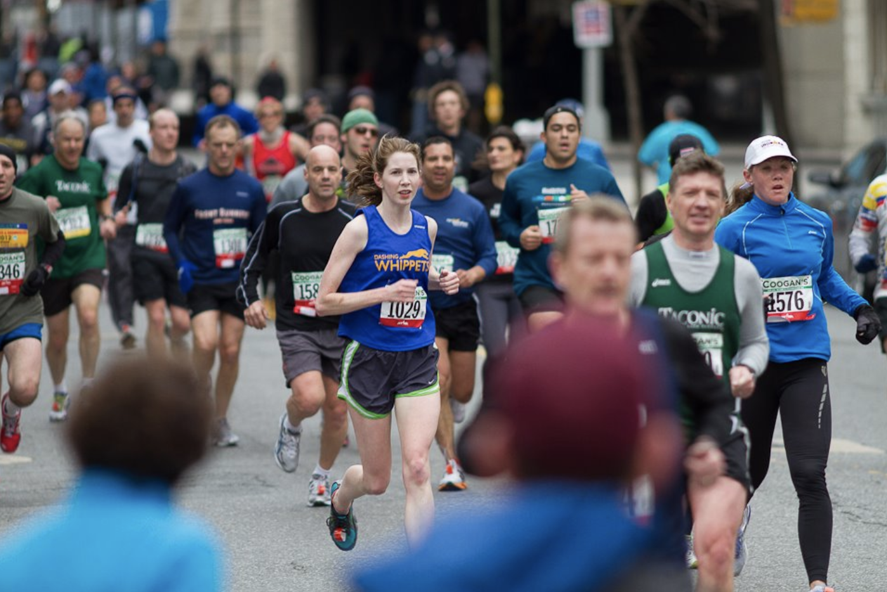
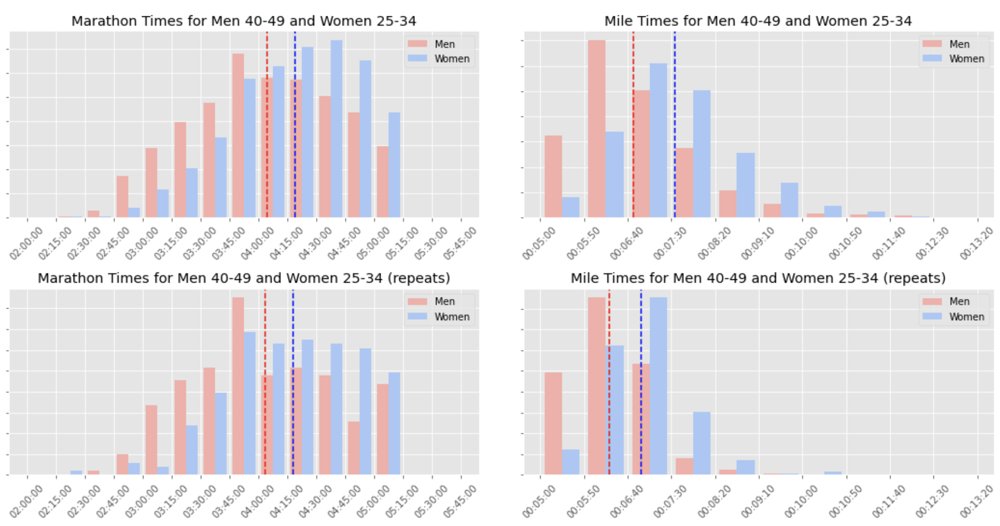
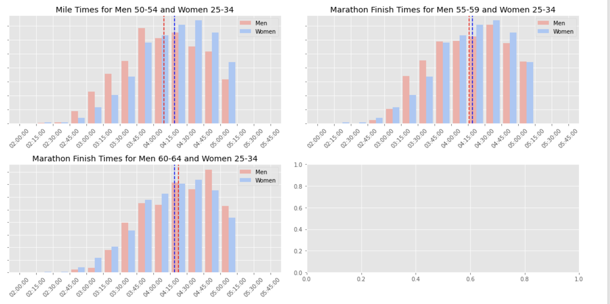
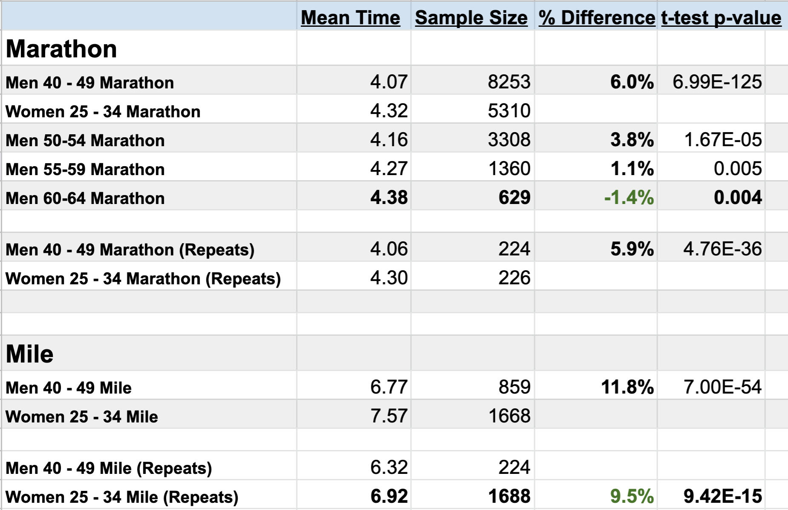

# Running Rivalries

## Insight into the Relative Competitiveness of Different Age-Gender Groups in the New York City Marathon

## Abstract: 

In this project I explored the idea of whether middle aged men and young women perform similarly in running races.  By scraping results data from the New York Road Runners website for the 2019 New York City Marathon and 2019 5th Avenue Mile, I used a t-test to compare the mean times for Women ages 25-34 to those of men in age groups 40-49, 50-54, 55-59, and 60-64, finding that the mean time for men was faster except in the case of the 60-64 age group.

## Background and Motivation
New York Road Runners holds around two dozen races annually in New York City, serving runners of all ages across distances from 200 meters all the way to the marathon.  I participated in dozens of races with them over the course of 7 years and I observed time and time again: the people nearest to me while I raced always seemed to be populated mostly by other competitive women in their 20s and 30s and men in their mid 40s.  My training partners often were middle-aged men and I began to wonder if in general young women were closely matched with men in their 40s. This hypyothesis seemed interesting to pursure, as at some point one would think that a man's advancing age begins to outweigh the advantages of his biological sex, when compared to younger women.  I also was interested in seeing how relatively competitive the groups were based on the distance of the race, either a mile or a marathon, because the mile race favors youth, whereas many people don't people in the marathon until their 30s or later.

This study also appealed to me because one reason I love running is how it brings people together in unexpected ways, across age, sex, and background, because at the end of the day, all that matters is how fast you are.  There's something beautiful to the idea that for all our differences in experiences, my best running buddy might be a man 15 or more years older than me (in fact, some already were; I learned a lot about fatherhood on my long runs!).

## Research Question, Data, and a Refined Research Question

*Question*: Do young women run as fast as middle-aged men in road races?

*The Data*: My big question of gender parity had to be narrowed so that I could conduct my research in a manageable way.  I used the race results for the 2019 New York City Marathon and the 2019 5th Avenue Mile from the New York Road Runners website.  The data included the name, age, gender, and finish time of each person.  I was able to select age groups in 5 year increments: Women 25-29, Women 30-34, Men 40-44, Men 45-49, Men 50-54, Men 55-59, Men 60-64.  Because my initial observation was based on my experience seeing many men in their 40s, I primarily focused on comparing the Men 40-44 and Men 45-49 to the women.  Using these two races as my samples, I hoped to make conclusions about the population of New York Road Runners race participants in general, regardless of year or distance.

*Refined Research Question*: Are the mean New York Road Runners race times the same for Women runners ages 25-34 and Men runners ages 40-49? 

## The Process

*Data Journey*: To obtain the data, I used Selenium to scrape the race results from NYRR.org, parsed the HTML through BeautifulSoup, and then stored the results in a MongoDB container.  Then, I moved all of the data to a Pandas Dataframe.

*Refinement*: I removed all race times that were slower than an average of 12 minutes per mile, as that is by some standards the cutoff for what is considered running instead of jogging.  The heart of my big picture question seeks to compared he average capabilities of these two demographics, so I wanted to filter the data even further, keeping only people who are competitive, meaning someone who keeps trying to run their best race, regardless of how fast they are.  I made a new dataframe that included only runners who ran both races, thinking that a person who did more than one race in a year would be more serious about pushing themselves to run their best.

## Explortatory Data Analysis
The histograms (with means graphed with the dashed line) clearly showed that the men were faster than the women in every race, except when the Men 60-64 were compared to the women in the marathon.  The data apppears relatively normally distrbuted and abruptly cuts off at about 5 hours 15 minutes for the marathon, as all runners who were running slow than a 12 minute mile were taken out of the data.

## Welch's T-Test:
For each of the male age groups, I ran a two tailed Z-test for the difference of two means with alpha = .05 against the data for the women.  The null hypothesis in each case was that the mean time for the populations is the same.  The results are shown below.

Because I used a two-tailed test with alpha=.05, in order to reject the null hypothesis, the p-value had to be less than .025, which it was in each case.  This means that in each pairing, the population means differ.  In most cases this meant the population means for the men are faster than those of women.  In the matchup between Men 60-64 and the women in the marathon, women were slightly faster.  When comparing Men 40-49 to the women, women were closer to the men in the marathon than in the mile (6% slower and 11.8% slower, respectively), which is the opposite of what I expected.  The women got slightly more competitive with the men when I narrowed the results to just people who had competed in both races, but not as much as I expected.

An interesting thing to note is that there were nearly 1.6x as many men 40-49 than women in the marathon and 2x as many women as men in the mile, which opens the question of why relatively more women sign up for the mile than for the marathon and how that could affect the results.

## Conclusions
The population mean finish times for women in New York Road Runners races are slower than those of men ages 40-59, but faster than those for men 60-64.  This study can be improved by taking data from other distances as well.

## Questions and Further Study
My study aimed to adress the abilities of men and women but only could measure performance, specifically the performance of people who are interested in road races.  Competitive spirit contributes to performance and it was impossible to control for in my project.  I would like to study what motivates men and women to run, as I believe I would find competitive people in both genders and also find that women are more likely to sign up for races even if just for the social and fitness aspect, which brings the average time down.

With any study like this I implpore the reader to take this data just for what they are: averages.  Your next training partner could be someone from a demographic you'd never expect.  The running world is one of cold, hard numbers and it's wonderful that we have a sport where an individual's results can speak for themselves.
